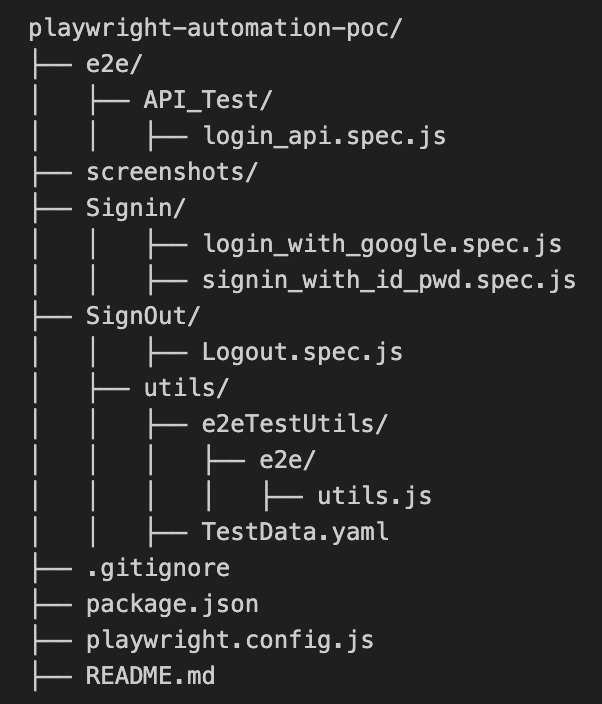
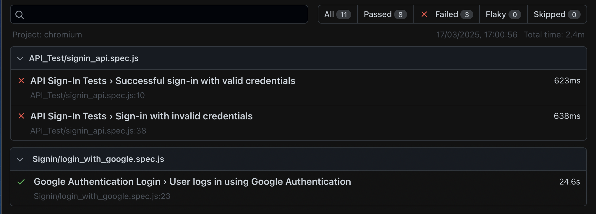

<h1 align="center">🎭 Playwright 🎭</h1>

[](https://www.npmjs.com/package/playwright) <!-- GEN:chromium-version-badge -->[](https://www.chromium.org/Home)<!-- GEN:stop --> <!-- GEN:firefox-version-badge -->[](https://www.mozilla.org/en-US/firefox/new/)<!-- GEN:stop --> <!-- GEN:webkit-version-badge -->[](https://webkit.org/)<!-- GEN:stop --> [](https://aka.ms/playwright/discord)

## [Documentation](https://playwright.dev) | [API reference](https://playwright.dev/docs/api/class-playwright)

Playwright is a framework for Web Testing and Automation. It allows testing [Chromium](https://www.chromium.org/Home), [Firefox](https://www.mozilla.org/en-US/firefox/new/) and [WebKit](https://webkit.org/) with a single API. Playwright is built to enable cross-browser web automation that is **ever-green**, **capable**, **reliable** and **fast**.

|          | Linux | macOS | Windows |
|   :---   | :---: | :---: | :---:   |
| Chromium <!-- GEN:chromium-version -->135.0.7049.17<!-- GEN:stop --> | ✅ | ✅ | ✅ |
| WebKit <!-- GEN:webkit-version -->18.4<!-- GEN:stop --> | ✅ | ✅ | ✅ |
| Firefox <!-- GEN:firefox-version -->136.0<!-- GEN:stop --> | ✅ | ✅ | ✅ |

Headless execution is supported for all browsers on all platforms. Check out [system requirements](https://playwright.dev/docs/intro#system-requirements) for details.

## Installation Playwright

Playwright has its own test runner for end-to-end tests - Playwright Test.

### Using init command

The easiest way to get started with the Playwright Test is to run the init command.

```Shell
# Run from your project's root directory
npm init playwright@latest
# Or create a new project
npm init playwright@latest new-project
```

This will create a configuration file, optionally add examples, a GitHub Action workflow and a first test example.spec.ts. You can now jump directly to writing assertions section.

### Manually

Add dependency and install browsers.

```Shell
npm i -D @playwright/test
# install supported browsers
npx playwright install
```

You can optionally install only selected browsers, see [install browsers](https://playwright.dev/docs/cli#install-browsers) for more details. Or you can install no browsers at all and use existing [browser channels](https://playwright.dev/docs/browsers).

* [Getting started](https://playwright.dev/docs/intro)
* [API reference](https://playwright.dev/docs/api/class-playwright)

## Reliable – No unreliable tests

**Automatic waiting**. Playwright waits until elements are ready before interacting with them. It also tracks events in real time, removing the need for manual delays, which often cause test failures.

**Smart checks**. Playwright’s built-in assertions are designed for dynamic websites. It keeps retrying checks until the right conditions are met.

**Detailed tracking**. Set up test retries, record execution traces, capture videos, and take screenshots to debug and prevent flaky tests.

## No compromises – no limits.

Browsers separate web content from different sources into different processes. Playwright follows this modern browser design and runs tests separately. This avoids common test runner restrictions.

**Test everything at once**. You can run tests across multiple tabs, different websites, and multiple users. Set up different user contexts and test them all together on your server.

**Real interactions**. Playwright can hover over elements, work with dynamic controls, and create real, trusted events—just like a real user.

## Complete separation – fast tests.

**Independent browser sessions**. Playwright opens a fresh browser context for each test, like a new user profile. This keeps tests completely separate without slowing things down. Creating a new context takes just milliseconds.

**Log in once**. Save the login state and reuse it in all tests. This avoids logging in repeatedly while still keeping each test fully isolated.

## Powerful Tooling

**[Codegen](https://playwright.dev/docs/codegen)**. Generate tests by recording your actions. Save them into any language.

**[Playwright inspector](https://playwright.dev/docs/inspector)**. Inspect page, generate selectors, step through the test execution, see click points and explore execution logs.

**[Trace Viewer](https://playwright.dev/docs/trace-viewer)**. Capture all the information to investigate the test failure. Playwright trace contains test execution screencast, live DOM snapshots, action explorer, test source and many more.

Looking for Playwright for [TypeScript](https://playwright.dev/docs/intro), [JavaScript](https://playwright.dev/docs/intro), [Python](https://playwright.dev/python/docs/intro), [.NET](https://playwright.dev/dotnet/docs/intro), or [Java](https://playwright.dev/java/docs/intro)?

## Examples

To learn how to run these Playwright Test examples, check out our [getting started docs](https://playwright.dev/docs/intro).


## Resources

* [Documentation](https://playwright.dev)
* [API reference](https://playwright.dev/docs/api/class-playwright/)
* [Contribution guide](CONTRIBUTING.md)
* [Changelog](https://github.com/microsoft/playwright/releases)


# Playwright Automation

This project is a POC for automating **end-to-end tests** using Playwright. The tests cover some functionalities, login, onboarding,logout, API test.

## Installation

1. Navigate to the project's overview page, then in the upper-right corner, select "Code" and choose either "Open in your IDE" or "Clone with HTTPS" or "Download source code -*(Extract the downloaded ZIP file to your local computer.)* to clone the project to your local machine

2. Open the project in your preferred editor (preferably Visual Studio Code):

3. Install the dependencies: 
   ```bash
   npm install
   ```

4. Install Playwright browsers: 
   ```bash
   npx playwright install
   ```

## Script Language
The scripts in this project are written in JavaScript, utilizing the Playwright framework for end-to-end testing.

## Project Structure (download the provided zip file and then extract its contents to a folder on your computer)



## Running Tests
To run all tests: 

To run the end-to-end tests: 
```bash
npx playwright test 
```

To run a specific test: 
```bash
npx playwright test [Test file relative path]
```

To start the interactive UI mode: 
```bash
npx playwright test --ui
```

To run the tests only on Desktop Chrome: 
```bash
npx playwright test --project=chromium
```

To run the tests in a specific file: 
```bash
npx playwright test example
```

To run the tests in debug mode: 
```bash
npx playwright test --debug
```

To auto generate tests with Codegen: 
```bash
npx playwright codegen
```

## Configuration
The test data and configuration are stored in the *TestData.yaml* file located in the *e2e/utils* directory. This file contains login credentials, expected URLs, and XPath selectors used in the tests.

### Example TestData.yaml
```yaml
valid_user:
  sername: 'YourValidEmailID@mail.com'
  password: 'YourPassword'

invalid_user:
  username: 'invalidemailid@gmail.com'
  password: 'invalid-password'

google_user:
  username: 'YourGoogleSSO@gmail.com'
  password: 'YourPassword'

expected_urls:
WebsiteURL: 'mytestwebsite.com'
api_base_url: 'API base url'

```

## Writing Tests
Tests are written using the javascript with Playwright test framework. Each test file is located in the e2e directory and follows a specific structure.

## Utilities
Utility functions are located in the utils directory and are used to perform common actions such as taking screenshots, buttons, logging out, handling popup steps, etc.

## Report Sample


